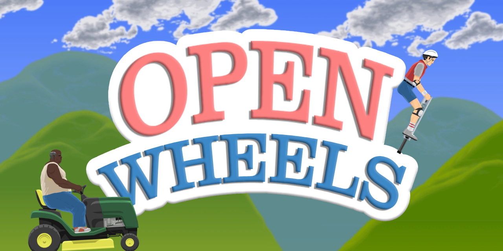

<p align="center">
  
</p>


# openWheels

**openWheels** is a community-led effort to deobfuscate, understand, and restore the original JavaScript/Typescript port of *Happy Wheels*. This project aims to preserve the game's codebase, improve readability, and open the door for learning, modding, and long-term community maintenance.

---

## 🎯 Project Goals

- ✨ **Readable Code** — Reverse obfuscation to make the codebase human-friendly
- 💾 **Preservation** — Keep the legacy of *Happy Wheels* alive and accessible
- 🔧 **Modding Support** — Enable custom characters, levels, and tweaks
- 📚 **Educational Value** — Learn from a real-world browser game architecture

---

## 🗂️ Project Structure

```
openWheels/
├── assets/              # Fonts and extracted game resources
│   └── fonts/
├── dependencies.js      # External library loader (likely PIXI, etc.)
├── favicon.ico          # Game favicon
├── happywheels.js       # Original game bundle (currently being deobfuscated)
├── index.html           # Main HTML entry point
├── main.js              # Project-specific JS hook into game logic
├── pixi.js              # PIXI.js game rendering library
├── readme.md            # This file
├── run.bat              # Windows batch file to serve the game locally
└── style.css            # Base styling
```
---

## 🚀 Running the Game Locally

You can run the project locally with any static file server. If you're on Windows, you can double-click `run.bat` to launch it.

### Or use the command line:
```bash
# Python 3.x
python -m http.server

# Or with Node.js
npx serve .
````

Then visit [http://localhost:8000](http://localhost:8000) (or whatever port your server uses).

---

## 📌 Current Progress

### ✅ Completed
- 🔍 **Initial Deobfuscation** — Code has been beautified and demangled from its minified form
- 🖥️ **Local Execution** — Game successfully runs locally via static hosting
- 🌐 **CORS Proxy Integration** — Connected to the official game server using a CORS proxy

### 🛠️ In Progress
- 🧠 Mapping obfuscated function/variable names to meaningful identifiers
- 🧩 Modularizing key systems (physics, rendering, input, etc.)
- 📜 Writing documentation and architecture notes

---

## 🧠 How You Can Help

We welcome contributions of all kinds:

* Refactor obfuscated code
* Document known functions and class behaviors
* Identify game bugs or rendering issues
* Help modularize the code
* Report findings via Issues or PRs

---

## ⚖️ Legal

> **Disclaimer:** This is a fan-made, educational project. All assets, names, and intellectual property related to *Happy Wheels* are owned by **Jim Bonacci / Fancy Force**. This project does not distribute the original proprietary files and does not claim ownership of the game's content.

We aim to operate under fair use for reverse engineering and preservation.

---

## 📢 Community & Support

Feel free to open issues, start discussions, or suggest features via GitHub.

---

## 🧾 Credits

* **Jim Bonacci / Fancy Force** – Original creator of *Happy Wheels*
* **PIXI.js** – Rendering engine used in the JS port
* **The openWheels team** – Reverse engineering

